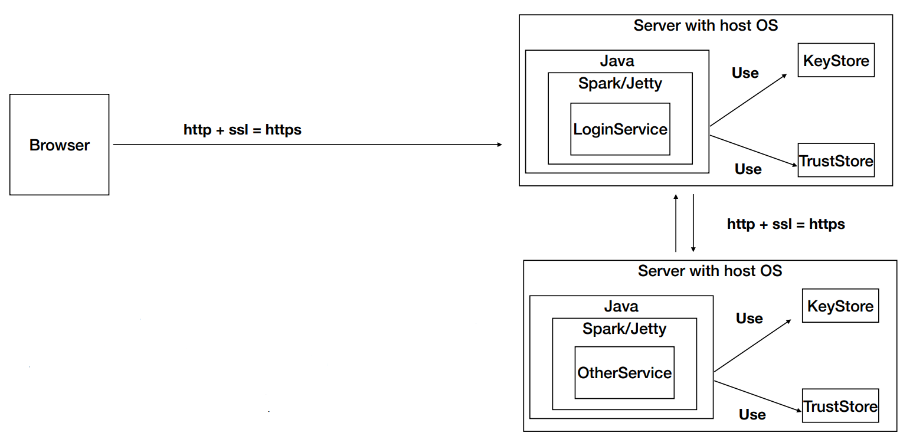

# Titulo

Secure App

## Descripción

En este repositorio encontrará una aplicacion con la siguiente arquitectura:



### Prerrequisitos

Para correr este se debe tener instalado:

- Maven
- Java

### Guía de uso

El proyecto necesita de unas variables de entorno para poder funcionaer correctamente, estas son:

- **PORT**: Puerto en el que se va a correr la aplicacion
- **KS**: KeyStore que se va a utilizar para la certificacion
- **KSPWD**: Password del KeyStore y trustStore
- **TSTORE**: TrustStore que se va a utilizar para la certificacion
- **NAME**: Nombre el que aparecerá en la página web
- **LINK**: Link de la página web a la que se va a conectar por ssl

**Nota**: Para poder correr el proyecto se debe tener el KeyStore y el TrustStore en la carpeta `./keystores`, en caso de subirlo a aws, debe usar los certificados con su respectivo dominio.

Una vez tenga todos estos datos, puede correr el proyecto con el siguiente comando:

```
java -cp target/classes:target/dependency/* co.edu.escuelaing.App
```

Tenga en cuenta que si corre en una maquina windows, debe cambiar el comando anterior por:

```
java -cp target/classes;target/dependency/* co.edu.escuelaing.App
```

## Integracion AWS

En caso de querer subirlo a AWS debe primero crear la instancia de ec2 y luego conectarse con sftp para poder subir el zip el proyecto, este se encuentra en la carpeta aws.

Una vez se suba este zip debe instalar java en la maquina, extraer el zip y correr el proyecto como se indica en la guía de uso.

### Video Demostrativo

Puede encontrar un video demostrativo de la aplicación funcionando en 2 servidores conectandose entre si a traves de la ruta remote, en el siguiente link:

[Video Demostrativo](./media/DemostracionAws.mp4)

## Proceso

Desplegando la aplicación como se indica en la guía de uso, comprobamos que la aplicación funciona correctamente, en el puerto que se asignó en las variables de entorno.

Una vez se compruebe esto, debe ir a la ruta hello, en la cual se le va a mostrar un mensaje de bienvenida, en el cual se le va a mostrar el nombre que se asignó en las variables de entorno.

Cuando compruebe estas dos cosas debe ir a la ruta remote, en la cual se le va a mostrar el mensaje hello de la otra aplicación que asignó en las variables de entorno.

## Autor

- **Juan Carlos Baez Lizarazo** - [juanbaezl](https://github.com/juanbaezl)

## Fecha

Octubre, 2022

## Licencia

Para más información ver: [LICENSE.txt](License.txt)

```

```
